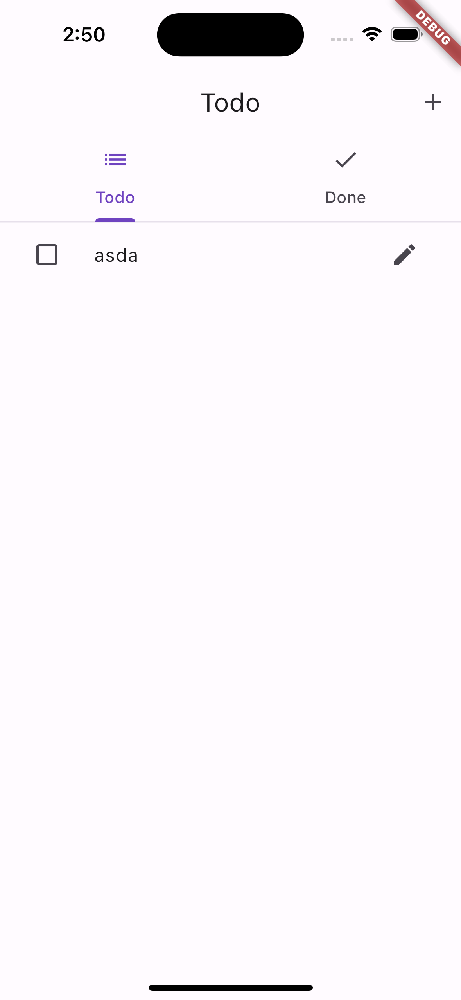

# flutter_todo_example

This is example of todo list app using flutter.

## Screenshots
| Todo List | Done Todo | Add Todo |
|:---:|:---:|:---:|
|  |  |  |

## Getting Started

```bash
$ flutter run
```

## 사용한 패키지

- [Hive](https://pub.dev/packages/hive)
- [Get](https://pub.dev/packages/get)
- [build_runner](https://pub.dev/packages/build_runner)


## 구현 설명
상태 관리 라이브러리는 GetX를 사용하였고, 해당 상태관리 라이브러리와 가장 잘 맞다고 생각하는 Clean Architecture를 적용하여 추후 코드 유지보수를 쉽게하고, 코드 가독성을 높이고자 하였습니다.

Clean Architecture를 도입하여, 프로젝트를 data / domain / presentation 의 레이어로 나누어 작업하였습니다.

Hive 라이브러리를 사용하여 로컬DB를 구현하고, NoSQL 방식으로 데이터를 저장하고 추후 다시 들어오더라도 데이터를 유지할 수 있도록 하였습니다.

## 프로젝트 구조
```
lib
 ┣ data
 ┃ ┣ datasources
 ┃ ┃ ┗ todo_local_datasource.dart
 ┃ ┗ repositories
 ┃ ┃ ┗ todo_repository_impl.dart
 ┣ domain
 ┃ ┣ entities
 ┃ ┃ ┣ todo_entity.dart
 ┃ ┃ ┗ todo_entity.g.dart
 ┃ ┣ repositories
 ┃ ┃ ┗ todo_repository.dart
 ┃ ┗ usecases
 ┃ ┃ ┣ get_todos.dart
 ┃ ┃ ┗ save_todos.dart
 ┣ presentation
 ┃ ┣ controllers
 ┃ ┃ ┗ todo_controller.dart
 ┃ ┣ pages
 ┃ ┃ ┣ edit_todo_page.dart
 ┃ ┃ ┗ todo_page.dart
 ┃ ┗ widgets
 ┃ ┃ ┗ todo_widget.dart
 ┣ routes
 ┃ ┗ routes.dart
 ┗ main.dart
```
